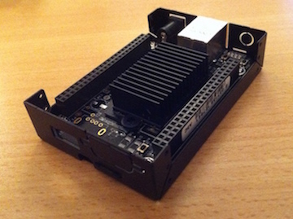
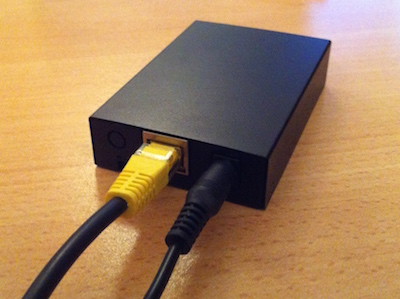

#  beagle-node
BeagleBone Black based Cryptocurrency node - [Live Dashboard](http://beagle-node.bealearts.co.uk)

[](https://raw.githubusercontent.com/DavidBeale/beagle-node/master/img/open-case.jpg)
[](https://raw.githubusercontent.com/DavidBeale/beagle-node/master/img/closed-case.jpg)

## BOM
1. [BeagleBone Black](http://beagleboard.org/BLACK) x1
2. Case [bb100](http://www.logicsupply.com/uk-en/components/beaglebone/boards-cases-kits/bb100/) x1
3. 64GB Class 10 microSD card x1 
4. Small Heatsink x1
5. Thermal Paste x1

## Hardware Installation

1. Attach the Heatsink to the CPU, and any other nearby chips you can cover.
2. Place the board into the case.
3. Insert the SD card.
4. Attach network and power cables.


## Software Installation

### OS
Ubuntu for BeagleBone Black, flashed to eMMC - [Instructions](http://elinux.org/BeagleBoardUbuntu#eMMC:_BeagleBone_Black)

### Update OS
```shell
sudo apt-get update
sudo apt-get upgrade
```

### Build Tools
```shell
sudo apt-get install build-essential libtool autotools-dev autoconf pkg-config libssl-dev
```

### SD Card Mount
```shell
sudo mkdir /sd
sudo mount /dev/mmcblk0p1 /sd
sudo echo /dev/mmcblk0p1  /sd ext4  defaults  0 0 >> /etc/fstab
```

### Swap Memory
```shell
sudo fallocate -l 2G /sd/swapfile
sudo chmod 0600 /sd/swapfile
sudo mkswap /sd/swapfile
sudo swapon /sd/swapfile
sudo echo /sd/swapfile none  swap  sw  0 0 >> /etc/fstab
```

### Compile bitcoind
```shell
sudo mkdir /sd/bitcoind
sudo mkdir /sd/bitcoind/src
sudo chown ubuntu:ubuntu /sd/bitcoind/src
cd /sd/bitcoind/src
wget https://github.com/bitcoin/bitcoin/archive/v0.10.0.zip  # Check for a newer version
unzip v0.10.0.zip
cd bitcoin-0.10.0
./autogen.sh
./configure --disable-wallet --with-incompatible-bdb
make # This will take a long time!
cd src
strip bitcoind
strip bitcoin-cli
sudo mv bitcoind /usr/bin/
sudo mv bitcoin-cli /usr/bin/
```

### Setup bitcoind
```shell
sudo useradd -m bitcoind
sudo mkdir /etc/bitcoind
sudo mkdir /sd/bitcoind/data
sudo chown bitcoind:bitcoind /sd/bitcoind/data
sudo wget https://raw.githubusercontent.com/DavidBeale/beagle-node/master/etc/bitcoind.conf > /etc/bitcoind.conf
sudo wget https://raw.githubusercontent.com/DavidBeale/beagle-node/master/etc/init/bitcoind.conf > /etc/init/bitcoind.conf
sudo nano /etc/bitcoind.conf # Edit the password to a secure one i.e. generated by bash -c 'tr -dc a-zA-Z0-9 < /dev/urandom | head -c32 && echo'
```

### Get the Blockchain
Download the Blockchain bootstrap.dat file from torrent [bootstrap.dat](https://bitcoin.org/bin/blockchain/bootstrap.dat.torrent) and place it in /sd/bitcoind/data

### Start bitcoind
```shell
sudo service bitcoind start
sudo tail -f /var/log/upstart/bitcoind.log  # Check the service starts
sudo tail -f /sd/bitcoind/data/debug.log # Check startup and progress - will take several hours/days to fully sync!
```
### Web Dashboard
Install [BTCnDash](https://bitbucket.org/mattdoiron/btcndash) by following the instructions in /doc/installation.rst
